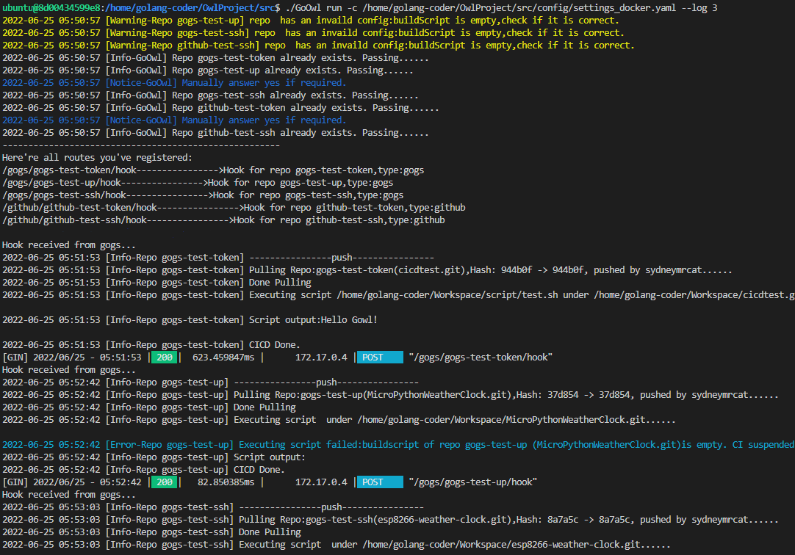
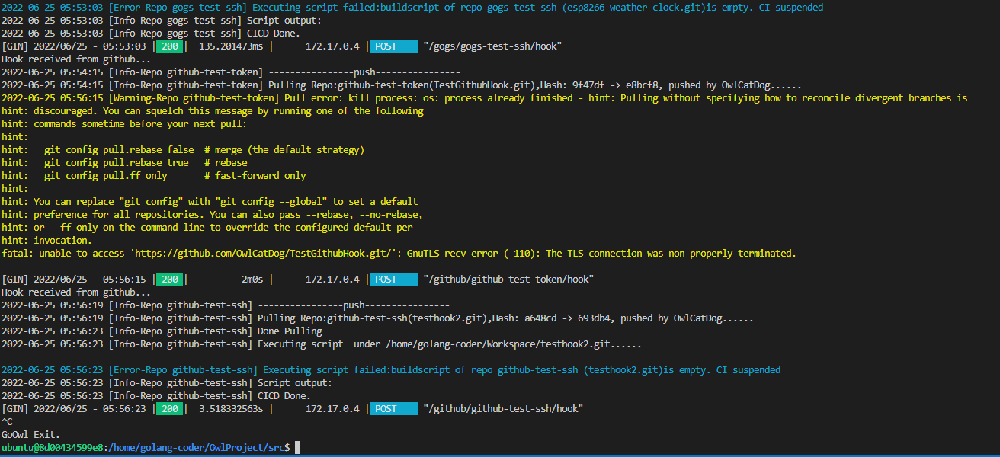

# GoOwl - A simple command-line CI/CD Tool
 [](https://goreportcard.com/report/github.com/sydneyowl/GoOwl) [](https://github.com/SydneyOwl/GoOwl/actions/workflows/codeql-analysis.yml)   [](https://pkg.go.dev/github.com/sydneyowl/GoOwl) [](https://github.com/sydneyowl/GoOwl/releases/latest) 
## What is GoOwl
GoOwl is a basic CI/CD tool. By filling a simple yaml file, you can:
- [x]  clone all repos automatically at the first time
- [x]  pull spcified repos when receiving hooks
- [x]  execute script when repos are pulled
- [x]  return a badge showing build status

## How to use GoOwl
 ***Windows and Mac releases are not reliable since they're not being tested.***

Firstly you need to fill a yaml file, which is located at config/standard.yaml and could be found in this repo. It should look like this if filled correctly:

```yml
settings:
  application:
    mode: release
    host: 0.0.0.0
    name: testApp
    port: 1234
  workspace:
    path: /home/golang-coder/Workspace
    repo:
      -
        id: gogs-test-token
        type: gogs
        trigger: ['push']
        repoaddr: https://git....
        token: abc
        buildscript: /home/golang-coder/Workspace/script/test.sh
        branch: master
      -
        id: gogs-test-up-userpass
        type: gogs
        trigger: push
        repoaddr: https://git
        username: 123
        password: 123
        buildscript: 
        branch: master
      -
        id: gogs-test-ssh
        type: gogs
        trigger: ['push']
        repoaddr: git@git...
        sshkeyaddr: /home/golang-coder/Workspace/id_rsa
        buildscript: 
        branch: master
      -
        id: github-test-token
        type: github
        trigger: push
        repoaddr: https://git
        token: ghp_....
        buildscript: /home/golang-coder/Workspace/script/test1.sh
        branch: main
      -
        id: github-test-ssh
        type: github
        trigger: push
        repoaddr: git@git...
        sshkeyaddr: /home/golang-coder/Workspace/id_rsa_2
        branch: main
```
+ `id` could be anything that could identify repos. Should be unique.
+ `workspace`.`path` defines the storage location of repos which are downloaded by GoOwl.
+ `buildscript` refers to the script you want to execute after specified repo is pulled. (this script will run in the directory of the repo so you don't need to use absolute addr.)
+ When using ssh, only `sshkeyaddr` and repoaddr in ssh form is needed. `username` and `password` is needed only when you need to access the repo via http(s). **However, if the repo is on github, you should use token instead of `username` and `password` since github does not support username and password authorization via http(s).**
+ `branch` refers to the branch you want to clone/pull.
+ Scripts will execute automatically when `trigger` matchs. For example, you pushed something to repo, and 'push' is included in `trigger`.

Ignore username,password or token if it is an public repo accessed via http(s) with correct settings.

*GoOwl supports webhook from gogs and github. More hooktypes will be supported in the future.*

>**authorization methods supported:**
>
>Gogs: ssh(privatekey)/http(username&password)/http(token)
>
>Github: ssh(privatekey)/http(token)
>
>**order of authorization by dafault**
>
>ssh->oauth->http

GoOwl reads config from `./config/settings.yaml` by default. You can also use `-c` to specify the yaml file if you don't want to put it in default location.

Run `./GoOwl --help` to get more info.

Run `./GoOwl checkenv` to check if everything work well.  

GoOwl uses Sqlite as database by default. Use -d(--database-location) to specify the position of the database. Default is `./GoOwl.db`; Also try --enable-sqldebug to print all sql sentences. 

Use `-l [1,2,3]` or `--log [1,2,3]` to use log func. 1 means output to stdout, 2 means output to file only, 3 means output to both file and stdout. They all storaged in `workspace.path/log` specified in the yml by default when log to file is enabled.

To start the hook listener and cicd server, run `./GoOwl run`. GoOwl will automatically clone repo at the first time. You need to input "yes" if you uses ssh to clone them. If you'd like to ignore repo checking(whether config is properly filled), use `--skip-repocheck`. 

GoOwl displays hook path on start(example):
```
------------------------------------------------------
Here're all routes you've registered:
/gogs/gogs-test-token/hook---------------->Hook for repo gogs-test-token,type:gogs
/gogs/gogs-test-up/hook---------------->Hook for repo gogs-test-up,type:gogs
/gogs/gogs-test-ssh/hook---------------->Hook for repo gogs-test-ssh,type:gogs
/github/github-test-token/hook---------------->Hook for repo github-test-token,type:github
/github/github-test-ssh/hook---------------->Hook for repo github-test-ssh,type:github
/status/:repoid/status.svg---------------->:repoid should be replaced to get repo status
```
you may use `https://domain:port/gogs/gogs-test-token/hook` as the hook address of repo gogs-test-token for example. When GoOwl received webhook, it will start executing script automatically and print result out. However, if repo failed to clone on start, the route of the repo won't be registered, which means the hook of the repo is unavailable. 

If you need a badge showing build status, you should use `/status/:repoid/status.svg` as the badge address, and the :repoid must be one of your repo ids. For example, `https://owl:1234/status/github-test-ssh/status.svg`

full example:



## More...
`GoOwl` may be buggy currently. Issues are welcome.

**Some part (/config/command and /app/other) of GoOwl comes from [gogs](https://github.com/gogs/git-module) and [go-admin](https://github.com/go-admin-team/go-admin) Thanks!**

**GoOwl uses [go-badge]("https://github.com/narqo/go-badge") to generate badge.**